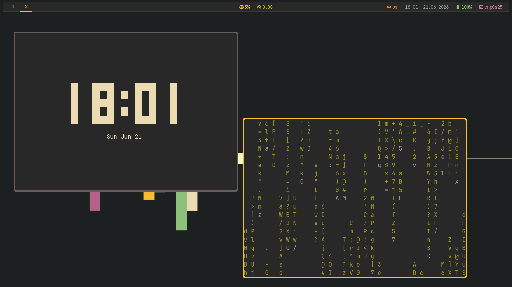
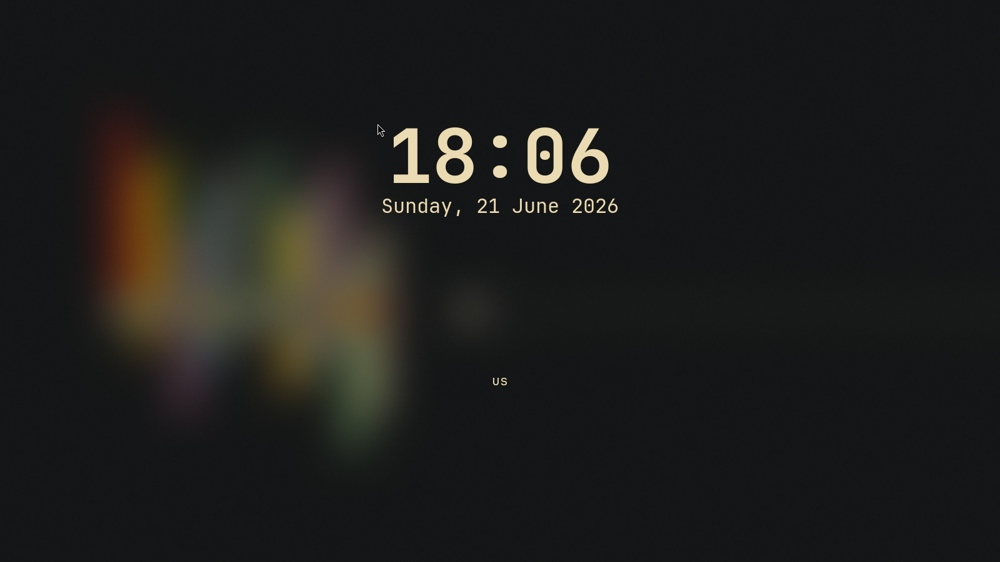
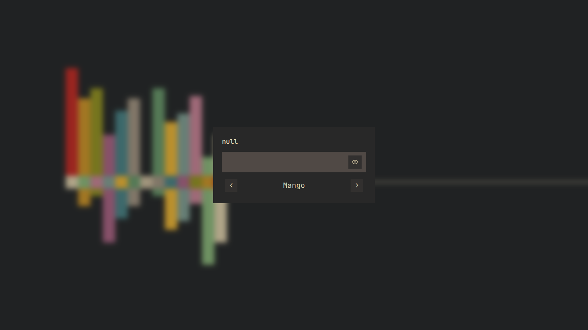

# MangoWM Gruvbox Dotfiles

Личные dotfiles для **MangoWM** (Wayland tiling compositor) в стиле **Gruvbox Dark**.

## Скриншоты

### Рабочий стол MangoWM



Главный рабочий стол с Waybar (теги, CPU, RAM, раскладка, время, дата, батарея, сеть), терминалом foot и активным окном. Gruvbox-цвета: тёмный фон, жёлтые акценты, зелёный/синий для статуса.

### Экран блокировки hyprlock



Hyprlock с размытыми обоями, большими часами, датой и индикатором раскладки клавиатуры.

### Экран входа SDDM



SDDM с Gruvbox-темой, размытым фоном, полем ввода пароля и выбором сессии (Mango).

## Что включено

| Компонент | Конфиг |
|-----------|--------|
| WM | [mango](https://github.com/DreamMaoMao/mango) — `~/.config/mango/config.conf` |
| Terminal | [foot](https://codeberg.org/dnkl/foot) — `~/.config/foot/foot.ini` |
| Status bar | [waybar](https://github.com/Alexays/Waybar) — `~/.config/waybar/` |
| Lock screen | [hyprlock](https://github.com/hyprwm/hyprlock) — `~/.config/hypr/` |
| Display manager | [SDDM](https://github.com/sddm/sddm) + Gruvbox theme — `~/.config/sddm-themes/` |
| Wallpaper | `~/Pictures/wallpapers/wallpaper.jpg` |
| Environment | systemd user environment — `~/.config/environment.d/` |
| Lock on suspend | systemd user service — `~/.config/systemd/user/hyprlock-suspend.service` |

## Требования

### Arch Linux

Основные пакеты из официальных репозиториев:

```bash
foot waybar hyprlock sddm swaybg fuzzel brightnessctl wireplumber
pipewire-pulse fastfetch grim slurp ttf-jetbrains-mono-nerd
nerd-fonts ttf-nerd-fonts-symbols swayosd
```

Из AUR:

```bash
mangowm
libinput-gestures  # опционально, для жестов тачпада
```

### Void Linux

Доступные пакеты устанавливаются через `xbps-install`. MangoWM возможно придётся собрать вручную, так как его может не быть в официальных репозиториях Void.

## Установка

```bash
git clone https://github.com/ВАШ_НИК/mangowm_dotfiles.git ~/mangowm_dotfiles
cd ~/mangowm_dotfiles
./install.sh
```

Скрипт спросит дистрибутив (Arch/Void), установит зависимости, скопирует конфиги, настроит SDDM и включит сервисы.

> **Важно:** после установки перезагрузитесь или перезайдите, чтобы изменения `environment.d` и группы `input` применились.

## Горячие клавиши

| Клавиша | Действие |
|---------|----------|
| `SUPER + Enter` | Открыть foot |
| `SUPER + D` | Открыть fuzzel |
| `SUPER + B` | Открыть браузер helium |
| `SUPER + Tab` | Overview |
| `SUPER + J/K` или `Left/Right` | Переключение фокуса |
| `SUPER + Shift + J/K` или `Left/Right` | Перемещение окна |
| `SUPER + Shift + Space` | Сбросить layout |
| `SUPER + N` | Сменить layout |
| `SUPER + 1..9` | Переключиться на тег |
| `SUPER + Shift + 1..9` | Переместить окно на тег |
| `ALT + \\` | Переключить floating |
| `SUPER + Shift + L` | Заблокировать экран (hyprlock) |
| `SUPER + Shift + S` | Suspend |
| `F1/F2/F3` | Mute / звук тише / громче (с OSD) |
| `F5/F6` | Яркость меньше / больше (с OSD) |
| `SUPER + Shift + E` | Выйти из MangoWM |

## После установки

1. **Установите MangoWM** из AUR (если Arch):
   ```bash
   yay -S mangowm
   ```
2. **Жесты тачпада** требуют `libinput-gestures` и группы `input`:
   ```bash
   yay -S libinput-gestures
   ```
3. **Уведомления и polkit** — опционально:
   ```bash
   sudo pacman -S mako polkit-gnome
   ```
4. **SDDM** — установка темы происходит автоматически, но если нужно вручную:
   ```bash
   sudo systemctl enable sddm
   sudo systemctl restart sddm
   ```

## Примечания

- Путь к обоям в конфигах заменяется автоматически на `~/Pictures/wallpapers/wallpaper.jpg` при запуске `install.sh`.
- Скрипт голосового помощника (`/home/null/voice_log/voice_input.py`) и его бинд — личные, при необходимости удалите или замените строку в `~/.config/mango/config.conf`.
- Для корректной работы `hyprlock` при suspend включён сервис `hyprlock-suspend.service`.

## Лицензия

MIT — используйте на свой страх и риск.
